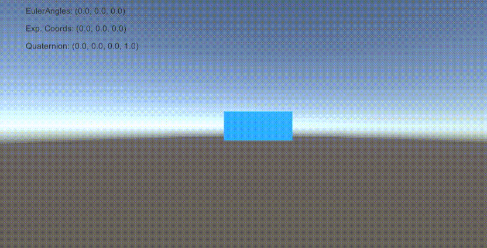

# Representing Rotation and Bezier Curve
1. Implement convertions between `Rotation Representations`
      * Euler --> Rotation Matrix
      * Rotation Matrix --> Quaternion
      * Rotation Matrix --> Exponential Map
      * Exponential Map --> Quaternion

**Euler**

    
     

**Exponential Map**

     

**Quaternion**

     

2. Implement `Bezier Curve` and `Frenet Frame`
  * Tangent, Normal, Binormal  

     

## Troubleshooting
### Convertering rotation matrix to quaternion
When Trace `Tr` of rotation matrix `R` is close to zero or negative, the conversion is unstable ([[link]](https://en.wikipedia.org/wiki/Quaternions_and_spatial_rotation#Conversion_to_and_from_the_matrix_representation)).

To make the conversion stable devide the conversion into four cases [[link]](https://en.wikipedia.org/wiki/Quaternions_and_spatial_rotation#Conversion_to_and_from_the_matrix_representation).

### Finding the Normal Vector of the Frenet Frame
[[link]](https://en.wikipedia.org/wiki/Frenet%E2%80%93Serret_formulas#Formulas_in_n_dimensions)

